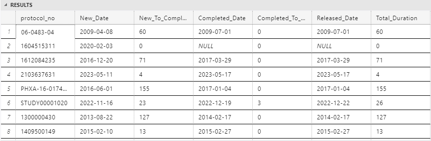
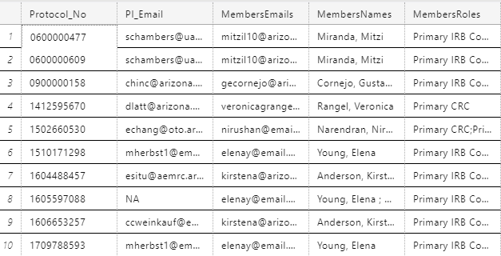

# Table of Contents
- [Table of Contents](#table-of-contents)
    - [Calendar Report](#calendar-report)
    - [CRC Reminder Email](#crc-reminder-email)
    - [Monthly Reminder Automated - Per Protocol](#monthly-reminder-automated---per-protocol)
    - [Recover Procedure Report](#recover-procedure-report)
    - [UACC Report](#uacc-report)
    - [Acuity Report](#acuity-report)

---

### Calendar Report
> This report is generated based on Wendy's request for showing the duration of transistioning from 1 Calendar Status to another.
[SQL Link](https://dev.azure.com/COM-CTMS/_git/OnCore-CTMS-Scripts?anchor=acuity-report&path=/Calendar%20Report.sql)



<!-- <details>
<summary>Code Block</summary>

```python
def my_function():
    print("Hello, World!") -->

### CRC Reminder Email
> This report is responsible for retreiving all Protocols that their Calenders' status is Completed and was sent to the CRC for validation.
[SQL Link]()

### Monthly Reminder Automated - Per Protocol

> This report generates the reminder emails for Summary Accrual Protocols' staff members
[SQL Link](https://dev.azure.com/COM-CTMS/_git/OnCore-CTMS-Scripts?anchor=acuity-report&path=/Monthly%20Reminder%20Automated%20-%20Per%20Protocol.sql)


### Recover Procedure Report

> This report was requested by Erica Christy, for now this report can only be generated from Oracle DB directly through SQL Developer because the amount of data is so big and the query times out through the Linked Server. Still wanna find a workaround to it
[SQL LINK](https://dev.azure.com/COM-CTMS/_git/OnCore-CTMS-Scripts?anchor=acuity-report&path=/Recover%20Procedure.sql)


### UACC Report

> This report still being pulled from SQL Developer
[SQL LINK](https://dev.azure.com/COM-CTMS/_git/OnCore-CTMS-Scripts?anchor=acuity-report&path=/UACC%20Report.sql)

### Acuity Report
>[SQL LINK](https://dev.azure.com/COM-CTMS/_git/OnCore-CTMS-Scripts?anchor=acuity-report&path=/Acuity%20Report.sql)